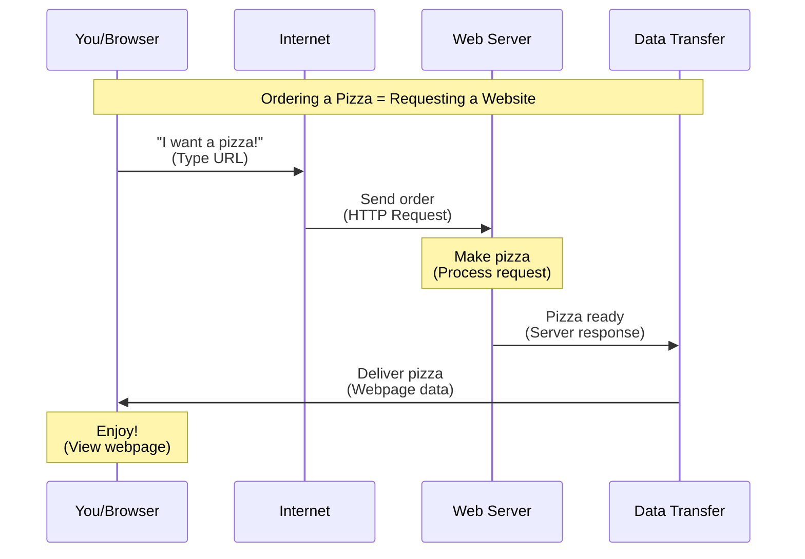
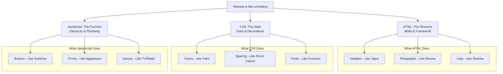

# Introduction to Web Development
## Session 1: How the Web Works

### 🎯 Learning Objectives

By the end of this session, students will be able to:
- Explain how websites work using the pizza delivery analogy
- Identify the main components of a website
- Install and navigate basic development tools
- Create their first HTML file

### 📚 Materials Needed

- Computers with internet access
- Installation files for VS Code and Chrome (as backup)
- Handouts with installation instructions
- Class whiteboard or display screen

---

### 1️⃣ Introduction (10 minutes)

#### Icebreaker: "Web Explorer"
- Ask students: "What's your favorite website and why?"
- Write responses on the board, grouping similar websites
- Circle common features that students mention

#### Course Overview
- Timeline: 15 weeks, 30 sessions
- Projects we'll build
- What we'll learn (HTML, CSS, JavaScript)

---

### 2️⃣ How the Web Works (30 minutes)

#### The Pizza Delivery Story 🍕



#### Real-world Comparison:
- Browser = You (hungry for a website)
- Web Address = Pizza place phone number
- Server = Pizza kitchen
- Internet = Delivery driver
- Webpage = Your delivered pizza

#### Common Issues:
- Wrong address = Typo in URL
- Pizza place closed = Server down
- Slow delivery = Slow internet
- Wrong order = Error in webpage

---

### 3️⃣ Website Components (Building Analogy) 🏠



---

### 4️⃣ Setting Up Our Tools (40 minutes)

#### Installing Visual Studio Code

1. Download VS Code:
   - Go to [https://code.visualstudio.com](https://code.visualstudio.com)
   - Click the big blue download button
   - Choose the correct version for your computer

2. Install VS Code:
   ```plaintext
   Step 1: Double-click the downloaded file
   Step 2: Accept the license agreement
   Step 3: Choose the installation location
   Step 4: Click "Install"
   ```

3. First Launch:
   - Pick a color theme
   - Tour the interface
   - Create a folder for web projects

#### Installing Google Chrome

1. Download Chrome:
   - Go to [https://www.google.com/chrome](https://www.google.com/chrome)
   - Click "Download Chrome"

2. Install Chrome:
   ```plaintext
   Step 1: Run the installer
   Step 2: Wait for automatic installation
   Step 3: Launch Chrome
   ```

---

### 5️⃣ Your First Webpage (Hands-on Practice)

1. Create a new file in VS Code
2. Save it as `index.html`
3. Type this code:

```html
<!DOCTYPE html>
<html>
<head>
    <title>My First Website</title>
</head>
<body>
    <h1>Hello World!</h1>
    <p>I'm learning web development!</p>
</body>
</html>
```

4. Save the file
5. Open it in Chrome

---

### 6️⃣ Wrap-up (10 minutes)

#### Review Questions
1. How is requesting a webpage like ordering pizza?
2. What are the three main parts of a website?
3. What does HTML do?
4. What extension do we use for web pages?

#### Homework
1. Complete installations if needed
2. Write three fun facts about the internet
3. Visit and list your three favorite websites
4. Try changing the text in your first webpage

#### Preview Next Session
- More HTML tags
- Creating a proper file structure
- Building an "About Me" page

---

### 📝 Teacher Notes

#### Common Issues to Watch For:
- Installation permission problems
- Typing errors in HTML
- Confusion about file extensions
- Difficulty finding saved files

#### Extra Activities (Time Permitting):
- VS Code feature scavenger hunt
- Browser developer tools peek
- HTML tag matching game

#### Differentiation Strategies:
- Pair struggling students with confident ones
- Have offline installation files ready
- Prepare simplified HTML template
- Create step-by-step handouts

---

### 🎮 Bonus Challenge

Create a webpage about your favorite:
- Game
- Movie
- Book
- Sport
- Hobby

Use the template we created in class and change the text to match your topic!

---

### 🔍 Success Criteria

Students should be able to:
- [ ] Explain how websites work using the pizza analogy
- [ ] Successfully install VS Code and Chrome
- [ ] Create and save an HTML file
- [ ] View their webpage in a browser
- [ ] Modify basic text in their webpage

---

### 📚 Additional Resources

- [VS Code Shortcuts (PDF)](example.com/vscode-shortcuts)
- [Basic HTML Guide (PDF)](example.com/html-basics)
- [Web Terms Glossary (PDF)](example.com/web-terms)

*Note: Links are placeholders. Replace with actual resource links.*
